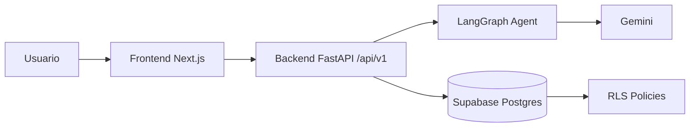
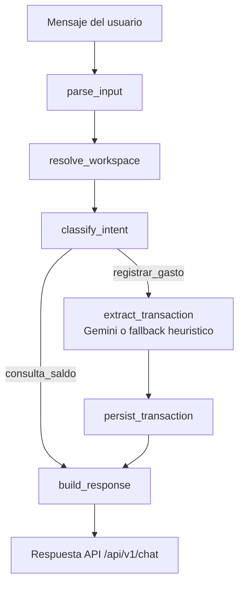
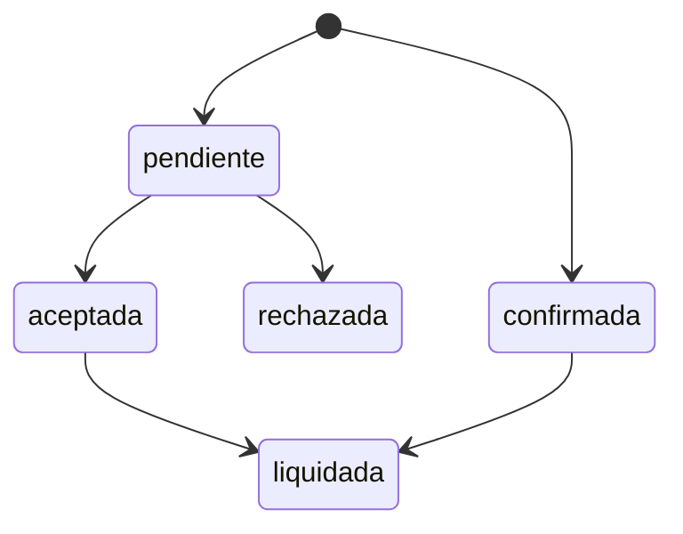

# Plataforma Financiera Chat-First

Monorepo para una PWA financiera multi-tenant con arquitectura Chat-First.

## Stack

- Frontend: Next.js (App Router), React, Tailwind, shadcn/ui.
- Backend: FastAPI, Supabase (PostgreSQL + RLS), LangGraph, Gemini.
- Monorepo: pnpm workspaces.

## Estructura

- `apps/frontend`: interfaz web (sin lógica de negocio pesada).
- `apps/backend`: API, servicios de dominio, agentes IA.
- `infra/supabase/migrations`: SQL de tablas, RLS y seed.
- `scripts/check-architecture.sh`: validaciones de arquitectura.

## Diagramas de Flujo

### Arquitectura General



### Flujo Chat (Registro de Gasto / Consulta de Saldo)



### Maquina de Estados de Transacciones Compartidas



## Requisitos

- Node.js 20+
- pnpm
- Python 3.10+
- uv

## Variables de entorno

Frontend (`apps/frontend/.env.local`):

```env
NEXT_PUBLIC_API_URL=http://localhost:8000
NEXT_PUBLIC_USE_MOCK=false
```

Backend (`apps/backend/.env`):

```env
ENV=development
API_V1_PREFIX=/api/v1
CORS_ORIGINS=http://localhost:3000
SUPABASE_URL=
SUPABASE_ANON_KEY=
SUPABASE_SERVICE_ROLE_KEY=
GEMINI_API_KEY=
```

## Instalación

### Frontend

```bash
pnpm install
```

### Backend

```bash
cd apps/backend
uv sync --group dev
```

## Ejecutar en local

Desde la raíz:

```bash
pnpm dev:frontend
pnpm dev:backend
```

Opcional (ambos en paralelo):

```bash
pnpm dev:all
```

## Scripts raíz

- `pnpm dev`: frontend.
- `pnpm build`: build frontend.
- `pnpm start`: start frontend.
- `pnpm lint`: lint frontend.
- `pnpm dev:frontend`: Next dev server.
- `pnpm dev:backend`: FastAPI con uvicorn.
- `pnpm dev:all`: frontend + backend.
- `pnpm check:architecture`: reglas de arquitectura e higiene.
- `pnpm check:frontend-services`: smoke checks de mapeo API frontend.
- `pnpm lint:all`: lint frontend + architecture check.
- `pnpm test:all`: architecture + frontend service smoke.

## Backend: pruebas

```bash
cd apps/backend
uv run pytest tests -q
```

## Arquitectura (reglas)

- `apps/frontend` no debe usar `app/api` ni Server Actions para dominio.
- Toda mutación de datos, IA y reglas de negocio viven en `apps/backend`.
- Seguridad multi-tenant: filtrar siempre por `espacio_id`/`perfil_id` y respetar RLS.

## API base

- Health: `GET /health`
- Auth: `POST /api/v1/auth/login`, `POST /api/v1/auth/registro`
- Perfil: `GET /api/v1/perfil`
- Chat: `POST /api/v1/chat`
- Espacios: `GET /api/v1/espacios`, `GET /api/v1/espacios/{id}`
- Apartados: `GET /api/v1/espacios/{id}/apartados`
- Miembros: `POST /api/v1/espacios/{id}/miembros`
- Transacciones: `GET /api/v1/espacios/{id}/transacciones`, `POST /api/v1/transacciones`, `PATCH /api/v1/transacciones/{id}/estado`

## Despliegue

### Frontend (Vercel)

- Configurar `NEXT_PUBLIC_API_URL` apuntando al backend desplegado.
- Configurar `NEXT_PUBLIC_USE_MOCK=false`.

### Backend (Railway/Render)

- `Procfile` en `apps/backend/`:

```txt
web: uvicorn src.main:app --host 0.0.0.0 --port ${PORT:-8000}
```

- Definir variables de entorno del backend en la plataforma.

## Smoke test recomendado

1. Iniciar sesión y confirmar redirección a `/chat`.
2. Enviar: `Gasté 150 en comida` y validar respuesta `gasto_registrado`.
3. Enviar: `¿Cuánto me queda para comida?` y validar `consulta_saldo` calculado.
4. Verificar carga real en `/dashboard`, `/espacios`, `/perfil` con `NEXT_PUBLIC_USE_MOCK=false`.
5. Probar transición inválida de estado y validar `422`.
